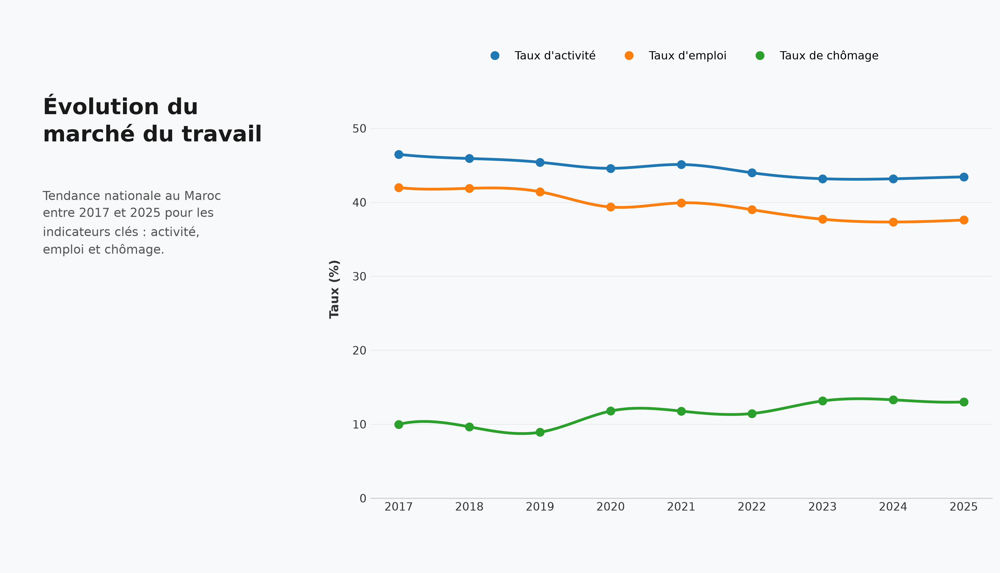
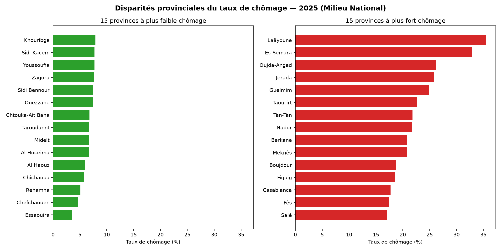
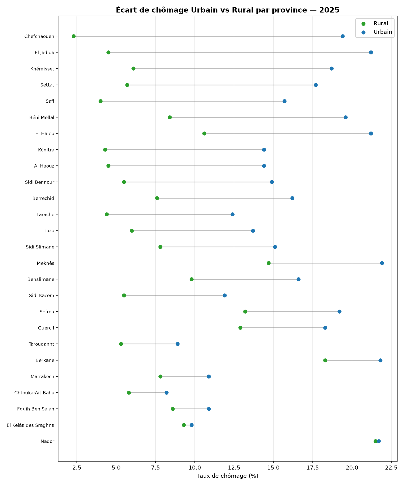
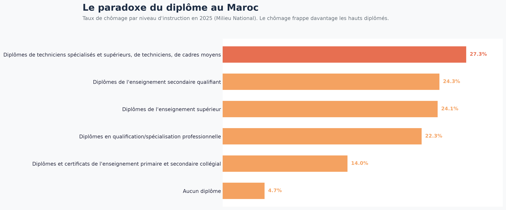
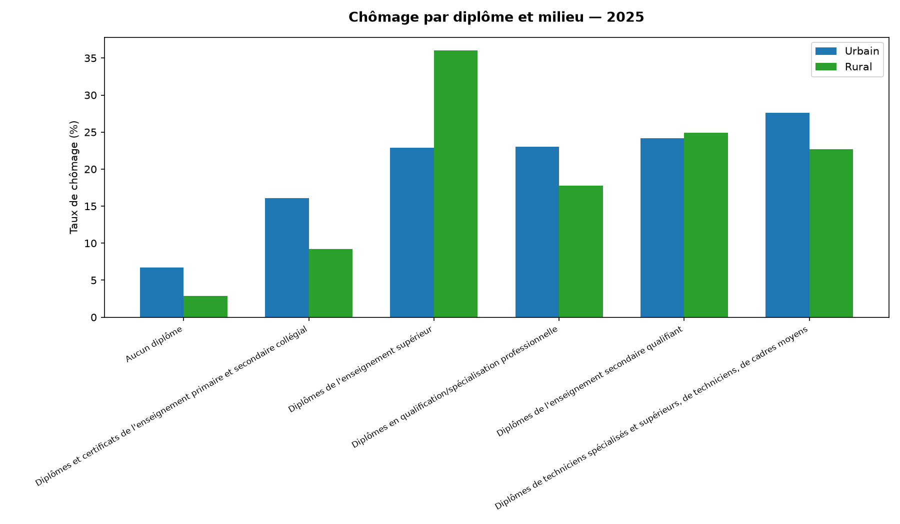
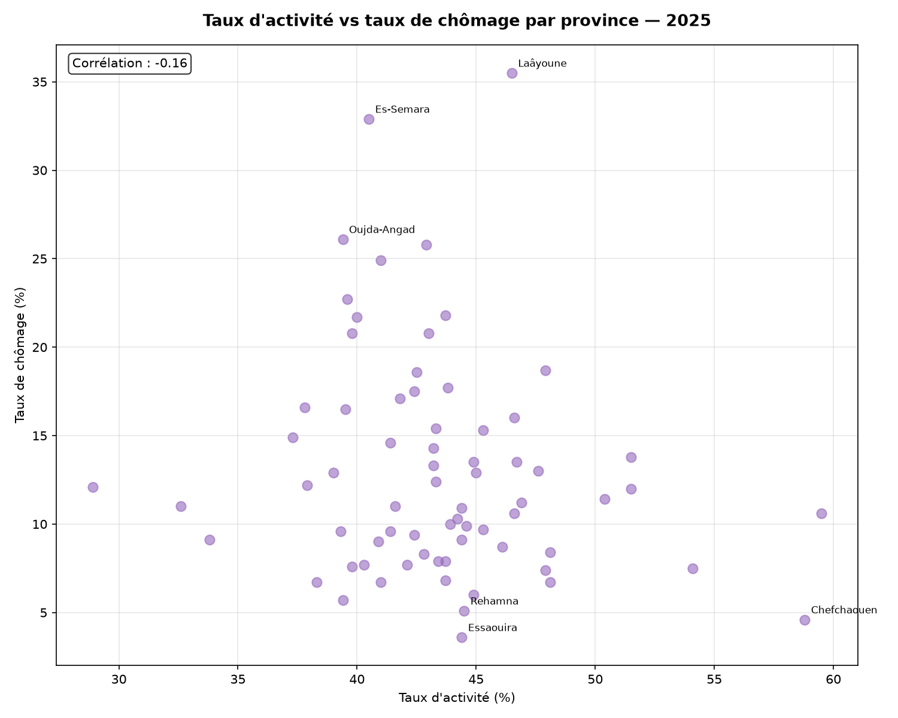

# Disparités régionales du marché du travail au Maroc

Analyse des disparités provinciales en matière d'activité et d'emploi au Maroc, et de leur lien avec le niveau d'éducation et le milieu de résidence (urbain/rural), à partir des données du Haut-Commissariat au Plan (HCP).

## Contexte

Ce projet a été réalisé dans le cadre d'une préparation estivale à un cursus d'ingénierie en Data Sciences & IA, comme premier projet de data analysis appliqué à un jeu de données réel et peu exploité (par opposition aux datasets génériques type Titanic/Iris).

Le choix du sujet s'appuie sur une recherche préalable du marché de l'emploi data au Maroc : les compétences les plus demandées (SQL, BI, data visualisation, nettoyage de données) et les secteurs qui recrutent (banques, télécoms, FMCG) sont notamment concentrés à Casablanca et Rabat. Ce projet mobilise des données socio-économiques marocaines originales plutôt qu'un dataset international recontextualisé.

## Question de recherche

**Quelles sont les disparités régionales en matière d'activité et d'emploi au Maroc, et dans quelle mesure sont-elles liées au niveau d'éducation et au milieu (urbain/rural) ?**

## Sources des données

Toutes les données proviennent de la [Base de Données Statistiques (BDS)](https://bds.hcp.ma) du Haut-Commissariat au Plan (HCP) et sont issues de l'Enquête Nationale sur l'Emploi (ENE), niveau province/préfecture, période 2017–2025 (2020–2025 pour la ventilation par diplôme) :

| Fichier | Contenu | Granularité |
|---|---|---|
| `activite_province_milieu.csv` | Taux d'activité | Province × Milieu × Année |
| `emploi_province_milieu.csv` | Taux d'emploi | Province × Milieu × Année |
| `chomage_province_milieu.csv` | Taux de chômage | Province × Milieu × Année |
| `chomage_diplome_milieu.csv` | Taux de chômage | Diplôme × Milieu × Année |

**Note méthodologique** : mi-2026, le HCP a remplacé l'ENE par une nouvelle enquête (EMO2026) avec une méthodologie différente. Cette analyse s'appuie volontairement sur la dernière année complète disponible sous l'ancienne méthodologie (2025) pour garantir la cohérence des séries temporelles.

## Méthodologie

1. **Exploration** : diagnostic de la structure des exports BDS (tableaux croisés avec catégories fusionnées, années en colonnes, ligne d'en-tête parasite)
2. **Nettoyage** : suppression des lignes parasites, forward-fill de la colonne milieu, passage du format wide (années en colonnes) au format long, exclusion de la catégorie de contrôle "Total"
3. **Fusion** : jointure des tables activité/emploi/chômage sur (province, milieu, année) en une table maître
4. **Visualisation** : 6 graphiques Matplotlib explorant les dimensions temporelle, géographique, et socio-démographique (éducation, milieu)
5. **Analyse** : interprétation prudente des corrélations observées, sans confondre corrélation et causalité

Outils : Python, Pandas, NumPy, Matplotlib.

## Visualisations clés

**1. Évolution nationale 2017-2025**

*Moyenne simple inter-provinces (non pondérée par population), à titre indicatif.*

**2. Disparités provinciales du chômage (2025)**


**3. Écart urbain/rural par province (2025)**

*Échantillon limité aux provinces disposant des deux valeurs (n=25) — le HCP ne publie pas de taux rural pour de nombreuses provinces, probablement faute d'échantillon suffisant.*

**4. Chômage selon le niveau de diplôme (2025)**


**5. Chômage par diplôme et milieu (2025)**


**6. Taux d'activité vs taux de chômage par province (2025)**


## Observations principales

- Le marché du travail marocain se stabilise autour de 13% de chômage national post-COVID, après le choc de 2020.
- Disparités provinciales massives : de 3,5% (Essaouira) à 35,5% (Laâyoune) — un facteur de 1 à 10.
- Deux clusters géographiques de chômage élevé se dégagent : la région de l'Oriental (Oujda-Angad, Jerada, Nador, Berkane, Taourirt) et les provinces sahariennes (Laâyoune, Es-Semara, Boujdour, Tan-Tan).
- Le chômage est structurellement plus élevé en zone urbaine qu'en zone rurale, presque sans exception.
- Plusieurs grandes métropoles (Casablanca, Fès, Salé, Meknès) figurent aussi parmi les provinces à fort taux de chômage — le clivage n'est donc pas simplement urbain-riche vs rural-pauvre.

## Tendances et paradoxes

- **Le paradoxe des diplômés** : le chômage augmente avec le niveau de diplôme, de 4,7% (aucun diplôme) à 27,3% (techniciens spécialisés et supérieurs).
- **Activité et chômage sont quasi indépendants** au niveau province (corrélation de -0,16) : un taux d'activité élevé n'entraîne pas mécaniquement plus de chômage, ce qui suggère que le chômage marocain relève davantage d'un problème de structure des emplois disponibles que d'un excès d'offre de main-d'œuvre.

## Interprétation (à prendre avec prudence)

Ces observations sont des corrélations, pas des relations de cause à effet :

- L'écart urbain/rural reflète probablement une différence de **nature** de l'emploi plus qu'un vrai avantage rural : le milieu rural absorbe sa population active via l'agriculture familiale et l'informel, peu mesurés par le taux de chômage officiel.
- Le paradoxe des diplômés suggère un déséquilibre structurel entre l'offre de formation supérieure et la création d'emplois qualifiés dans l'économie marocaine.
- Les clusters géographiques (Oriental, Sahara) pointent vers des causes locales spécifiques (zone frontalière, désindustrialisation minière, diversification économique limitée) que ces données seules ne permettent pas de confirmer.

## Limites des données

- Certains taux (notamment le chômage rural pour les diplômés du supérieur) reposent sur de petits échantillons et doivent être lus avec prudence — de fortes variations peuvent refléter une instabilité statistique plutôt qu'une vraie tendance.
- Le HCP ne publie pas systématiquement le taux de chômage rural pour toutes les provinces, probablement par manque de significativité statistique.
- La moyenne nationale calculée ici est une moyenne simple inter-provinces, non pondérée par la population — elle diffère légèrement du taux national officiel du HCP.

## Question ouverte

Le taux de chômage plus faible en zone rurale traduit-il un marché du travail réellement plus sain, ou masque-t-il un phénomène de sous-emploi et d'emploi informel non mesuré par cet indicateur ? Une analyse croisant ces données avec le taux de sous-emploi (disponible dans les mêmes tables BDS) permettrait d'approfondir cette question.

## Prochaines étapes

- **v2 (après la phase SQL)** : charger les données dans une base SQLite/PostgreSQL et remplacer les filtres Pandas par des requêtes SQL (jointures, fenêtrage temporel, agrégations).
- **v3 (après la phase Machine Learning, optionnel)** : tester une prédiction simple, par exemple estimer le taux de chômage provincial à partir d'indicateurs socio-économiques disponibles (niveau de diplôme dominant, taux d'activité, milieu).

## Structure du projet

```
├── data/
│   ├── clean/          # tables nettoyées et fusionnées
│   └── raw/            # exports bruts du BDS (HCP)
├── outputs/            # graphiques générés
├── exploration.py
├── nettoyage.py
├── visualisation.py
└── README.md
```